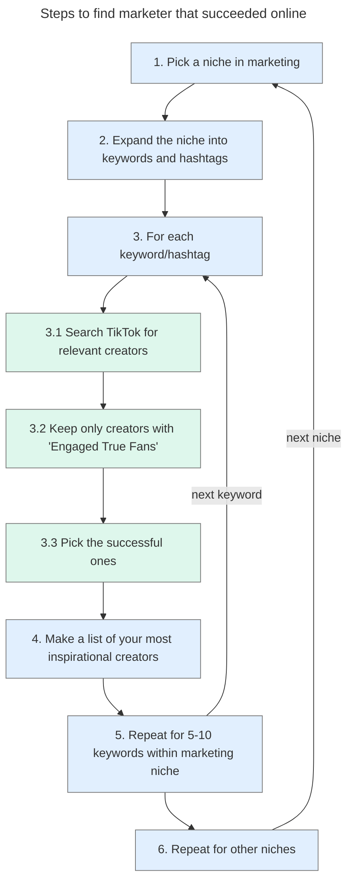
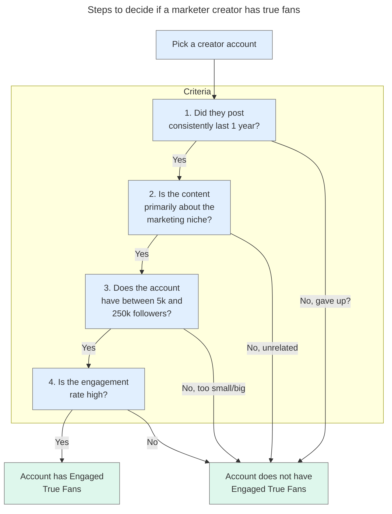
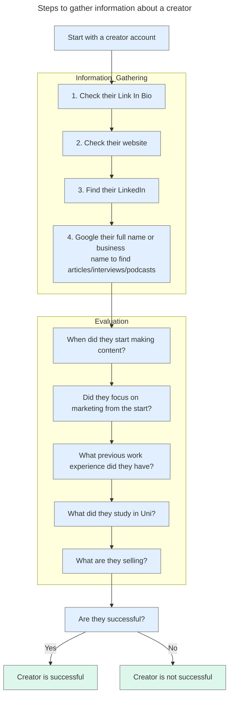

# ValueHeads Phase 2 - Become a Marketer and a Creator

> This is my first draft of the new strategy. Let's build this concept together more.

```table-of-contents
title: 
style: nestedList # TOC style (nestedList|nestedOrderedList|inlineFirstLevel)
minLevel: 0 # Include headings from the specified level
maxLevel: 0 # Include headings up to the specified level
includeLinks: true # Make headings clickable
debugInConsole: false # Print debug info in Obsidian console
```

---
<div style="page-break-after: always;"></div>

## What do we want to accomplish over the next 12 months?

### Objective A: Make you income $
We need to open up multiple options for you to make money:
- **As a co-founder**: Marketing expertise will help you be confident when you approach a developer to be your co-founder. Having proven knowledge and true fans in the niche/space where your idea is makes a huge difference. It shows the money is right here waiting.
- or, **As a freelancer**: If you have proven marketing experience, you can take projects for $100+/hour.
- or, **As an affiliate**: By digging into a marketing niche and establishing yourself via content, you will find pain-points. Those can be solved by recommending affiliate products and teaching how to use them at a higher-level to accomplish a goal - gain value from the process as well as the product.

### Objective B: Build your connections with marketers
The only number we care about is how many true fans you've made! These are people you know, people you can arrange a zoom call with.

We do not care about the number of YouTube subscribers or TikTok followers. True fans only!

**Deep connections is all that matters!** People need to trust you for connection to happen.

You want to have coffee over Zoom with as many marketers and creators of different types as possible. People marketing their work, their company, their art, their books, their music.

### Objective C: Build your reputation as a marketing expert
This is what people see when they search your name. Your LinkedIn website, and whatever your publish on the internet with your name.

Updating your LinkedIn and publishing articles, videos, etc content **are all in your control**. You are in charge of that.

It needs to be the portfolio and the search results you'd expect from an expert in that marketing niche.

Think about it like this. When you go to a conference and people search you up on LinkedIn or on Google, your name needs to show up looking like a marketer who knows their stuff. Active profiles with valuable content published.

That's what we need to build!

---
<div style="page-break-after: always;"></div>


## Why pick a marketing niche specifically, and not another niche? Not just one path to success, but multiple. 

The path I am advising you to take is to [pick a niche in marketing](https://valueheads.org/marketing-tree/) as a starting point. But why?

![[Pasted image 20240629135015.png]]

### 1. Create multiple paths to success (income $) for yourself
Marketing is an industry with lots of money moving around. Positioning your self as an expert makes it a path that offers multiple ways of succeeding to achieve objective A (making money) over the next 12 months.

Think about it like this; what would your LinkedIn profile look like in one year if you picked a niche say like mattresses, or electronics, etc? Would that reputation help you be a co-founder or get hired at $100+/hour? The odds are low, as knowing about these niches is not a transferable skill!

When you pick to become an expert in for example TikTok Ads, Instagram Reels, App Store optimization, etc, in 12 months of producing valuable content and connecting with marketers, you can help many businesses market on TikTok, engage better on Instagram or get higher visibility on the app store. People will pay you for these skills, and not just in one industry. **It's a transferable skill.**

This way you can make money as a freelancer, co-founder, affiliate or even get a job as a last line of defense against reaching the 12 month mark unsuccessful.
### 2. Focused rather than scattered search
Instead of searching all over the place for ideas from affiliation, to apps, etc, we will be more focused on the huge world of marketing online.

It's a market estimated to be $740 Billion dollar in size in 2024, see [Digital Advertising - Worldwide | Statista Market Forecast](https://www.statista.com/outlook/dmo/digital-advertising/worldwide).

When you take that into consideration, it's a pretty safe bet that when you get good at marketing, there is money to be made!

### Conclusion: Marketing Reputation & Connections is the best path

Our ultimate goal of you making reliable income can be achieved by **building your skills and reputation as and expert marketer** as well as **building meaningful connections** with marketers and businesses.

By focusing on a marketing niche:
1. You will be able to focus your content and efforts into just that niche.
2. You will be able to study the certifications related to it to update LinkedIn to gain more trustworthiness in that niche.
3. You have a clear topic to talk to other marketers about - your chose niche. Easier to make connections if you are using your time to teach them something or help them.
4. Your publications will be consistent. Your LinkedIn profile, your website articles, your YouTube videos, your TikTok will all prove that you know that marketing niche.

This focus will signal expertise to other people.

#### Side note: Other high income skills that could lead to your success
Marketing is not the only option to make money working online, but it's the path you should take if your goal is to become a co-founder of a software business.

I'd say a list of "you can learn it on your own" high-earning skills could be summarized as follows:
- **Software Development / Coding**: Think of full stack developers, backend devs, dev-ops, server and db management etc. Web development and app development is a subset of that skill set.
  *Problem: Might take you 2-3 years to learn! If you like coding or already have the skill, you probably already have the skills needed to be a co-founder, and learning marketing enables you to be a solo founder - makes you even more powerful.*
  
- **User Experience (UX) and Product Design**: You design products and user interfaces and make sure the experience is optimal for the user.
  *Great path, allows you to be a co-founder. Problem: you still need to market yourself as a UX designer, and you'll need to market the product, so optimally, you combine this with marketing.*
  
- **Copy-writing (writing to sell!)**: Help businesses make more money by optimizing their articles, ads, landing page text and design in a way to help them sell more, convince people to buy better, and so on.
  *This is a must for all marketers. 100%. It's part of our phase 2 course. You need to know how to sell. You do that with words, emotions, and empathizing with your customers. This is crucial and needs practice.*
  
- **Software consulting**: I love Ali Abdaal's example of Notion consulting (a note taking app), see video below.
  *I am not an expert on this path, but I think the problem with it is scalability.*

Sell these skills to businesses not consumers. Must watch Ali Abdaal's video: [5 High Income Skills Students Can Learn in 2024 - YouTube](https://www.youtube.com/watch?v=FeLNpX1GljM)


---
<div style="page-break-after: always;"></div>

## Why engaging video content is the way to go?

> BEGIN: ChatGPT summary. These bullet points were summarized by ChatGPT. 
> To see how I had GPT only include factual information from search, see [ChatGPT chat](https://chatgpt.com/share/7a92002e-28ec-43a4-99c4-2f34245fe7b3).

Engaging video content continues to be a dominant force in marketing, significantly outperforming non-video content in terms of conversion rates and overall effectiveness in 2024. Here are some updated insights from recent research:

- **Higher Conversion Rates**: Video content leads to conversion rates 34% higher than non-video content and can boost landing page conversions by up to 80%​ ([Dash DAM](https://www.dash.app/blog/video-marketing-statistics))​​ ([Influencer Marketing Hub](https://influencermarketinghub.com/video-marketing-statistics/))​.
- **Increased Engagement and Retention**: Videos generate 1200% more shares than text and images combined and have a 50% retention rate for videos under 90 seconds​ ([SocialPilot](https://www.socialpilot.co/blog/video-marketing-statistics))​​ ([Influencer Marketing Hub](https://influencermarketinghub.com/video-marketing-statistics/))​.
- **SEO and Traffic Benefits**: Videos on web pages can increase organic traffic by 138% and keep visitors on sites nearly three times longer​ ([WebFX](https://www.webfx.com/blog/marketing/video-marketing-statistics/))​​ ([Influencer Marketing Hub](https://influencermarketinghub.com/video-marketing-statistics/))​.
- **User Preference**: 80% of consumers prefer watching videos over reading text, and 95% of marketers say video helps buyers understand products better​ ([SocialPilot](https://www.socialpilot.co/blog/video-marketing-statistics))​​ ([Influencer Marketing Hub](https://influencermarketinghub.com/video-marketing-statistics/))​.
- **Platform Effectiveness**: YouTube is used by 90% of marketers, with 70% of viewers making purchases after watching branded content. Instagram Reels generate twice the reach of other content types​ ([SocialPilot](https://www.socialpilot.co/blog/video-marketing-statistics))​​ ([Semrush](https://www.semrush.com/blog/video-marketing/))​.
- **Increased Marketing Budgets**: 85% of marketers plan to maintain or increase video marketing budgets in 2024, with annual budget increases averaging 25%​ ([SocialPilot](https://www.socialpilot.co/blog/video-marketing-statistics))​​ ([Semrush](https://www.semrush.com/blog/video-marketing/))​.

> END of ChatGPT summary.

### TikTok/Instagram vs YouTube

I think there is a solid path using only short videos + articles, skipping the more time consuming path of creating long-form YouTube videos (for the beginning at least).

Also, TikTok Videos show on Google search, so keyword optimization is still in game.

![[Pasted image 20240630125109.png]]

---
<div style="page-break-after: always;"></div>


## How to find successful examples

The goal is to find people who became successful in a marketing niche by building reputation in that niche.

We want to learn from their content types, what works and what doesn't. We want to learn from their public journey on social media, on LinkedIn, etc.

By reverse engineering their success, we can create out plan. A plan with a proven market, proven path and proven case studies. 

### The Method: How to find those marketer success cases?

Here is a quick overview of the steps:
1. [Pick a niche in marketing](https://valueheads.org/marketing-tree/) as your starting point.
2. Expand the niche into keywords, hashtags, etc. Ahrefs? GPT prompt?
3. For each keyword/hashtag
	- Search TikTok for those keywords and hashtags and open 10 tabs with different creators ONLY if the video found looks like a valuable piece of information in your marketing niche (or similar to it).
	- From those, keep only creators matching: [[#Selection Criteria Engaged True Fans]]
	- From the creators left, pick and learn from the successful ones: [[#How to decide if they are successful?]]
4. In a document or note taking app, document your favorite, most inspirational creators that you feel you can learn from and replicate their journey to success.
5. Repeat step 3 for 5 - 10 keywords within that niche.
6. Repeat for other niches from step 1.



#### Selection Criteria: Engaged True Fans 
Does he/she have true fans that are marketers that are engaged with the content?

We need to find health account, accounts with true fans. To decide if their audience is engaged in their value marketing content, the best public indicator we can use is the **engagement rate percentage**. 

High engagement rates indicate that the audience (followers of that account) are indeed marketers. It also shows that the video/content was valuable enough to deserve to many likes/shares/comments. Those are marketers who gain value from that creator's content.

**Steps to decide if an account has true fans:**
- [ ] 1. **Activity**: Have they been posting with consistency in the past year?
- [ ] 2. **Content (video) topics**: Is their content primarily about the marketing niche or marketing?
- [ ] 3. **Followers**: 5k to 250k (as bigger accounts might be harder to analyze their success, and smaller have not much to learn from). These numbers are NOT set in stone, just a guidance. If you are researching a very niche topic the pool of interested people is smaller than a wider niche.
- [ ] 4. **Engagement rate:** From their videos in the last 2 months, pick the one with highest number of views. It MUST be about the marketing. Then add the number of likes + shares + comments and divide by their follower count: 
   `best video engagement rate = (likes + shares + comments) / followers`



#### How to decide if they are successful?
How did he/she succeed? Are they making money?

To do so, we need to learn as much information about their journey as possible from sources like LinkedIn, their sites, Link In Bio, etc.

We want to answer these questions:
- When did they start making content? Did they focus on marketing from the start?
- What previous work experience did they have? You'll find many without marketing experience before hand.
- What did they study in Uni?
- What are they selling? 

**Steps to gather information about a creator:**
- [ ] 1. Check their **Link In Bio**. Usually that tells you what makes them money, like selling course, affiliate links, agency work, hire me 1-on-1 work, etc.
- [ ] 2. Check their **website**: How do they present themselves or the product? What are they selling?
- [ ] 3. Find their **LinkedIn**: What is their background education and previous experience?
- [ ] 4. **Google** their full name or their business name to find **articles / interviews / podcasts** with them discussing their business. Learn from it if you find it. Usually, you won't find much of that content, but when you do, it's a learning opportunity.

Are they successful? If they have been posting steadily, targeting marketers, selling their services or products, proud on LinkedIn about what they do and so on, these are signs of success.

> **Don't forget** to keep a list of creators that inspire you. The people with relatable stories to you. These might not be big accounts, people without years of marketing experience, and so on. Let's study that subset of success cases, that started on their own, with not much experience in the field, and seem to have succeeded. 





### A follow-along example

Let's follow a real example! 

> TODO video

##### List of examples found on TikTok

**Searched on TikTok.** A lot more examples can be found.

Top examples
- [Chur Lim](https://www.tiktok.com/@chur.lim) Good example on Tiktok, but can't find traffic amount to his domain. Goal seems to build a marketing agency in Australia.
- [Luke Thorburg](https://www.tiktok.com/@lukethorburg) on TikTok. No previous experience running agency ([LinkedIn](https://www.linkedin.com/in/luke-thorburg/)). 
- @thestevenmellor on [TikTok](https://www.tiktok.com/@thestevenmellor) & [Instagram](https://www.instagram.com/thestevenmellor/?hl=en), started 4 years ago, sells courses, doing very well, good traffic 5k/m, see [SimilarWeb](https://www.similarweb.com/website/stevenmellor.com/#ranking). Great LinkedIn profile, no previous experience. Not much SEO, but overall solid brand.
- [Mino on TikTok](https://www.tiktok.com/@mino.mp4) - sells course subscription @ http:s//content-academy.io. Not much experience before - business school has nothing with video creation. [See his LinkedIn](https://www.linkedin.com/in/mino-lee-b6091721b/)
- https://www.tiktok.com/@ugcang sells course and 1-on-1 sessions (consultancy). See site [UGC Ang Portfolio](https://ugcang.com/).
- [Erfan Ranjbar](https://www.tiktok.com/@digitalgrowthwitherfan) - found himself a job [(see LinkedIn)](https://www.linkedin.com/in/erfanau/) from it and started video late.
- [@ugcwithemmap](https://www.tiktok.com/@ugcwithemmap), on [LinkedIn](https://www.linkedin.com/in/emma-persson-7a970982/?original_referer=https%3A%2F%2Fwww%2Egoogle%2Ecom%2F&originalSubdomain=se)


---

Other examples (might not be as relatable as they have solid marketing experience, etc):
- [Dara Denney](https://www.youtube.com/@DaraDenney) Amazing on YouTube, also on [TikTok](https://www.tiktok.com/@daradenney) and [LinkedIn](https://www.linkedin.com/in/daradenney/) 
- [@sellanythingonline](https://www.tiktok.com/@sellanythingonline) leads to book me [Anaita - Book Me](https://www.sellanythingonline.com.au/store)
- [@samdespo](https://www.tiktok.com/@samdespo) - huge with course, tiktok ads affiliation (30% off ads) and ad agency.
- [@officialmattbell](https://www.tiktok.com/@officialmattbell) -> hire me for your strategy
- [@marketingmei](https://www.tiktok.com/@marketingmei) -> agency too
- @heyitswil, @cleong.media, @mr.paidsocial, @razr_media (small account, doing well)
- [@brandnat](https://www.tiktok.com/@brandnat)
- https://www.tiktok.com/@chase_chappell
- https://www.tiktok.com/@johnnybarrofficial niched into clothes marketing
- https://www.tiktok.com/@mike.rama
- https://www.tiktok.com/@mohamed_benchekroun moroccan guy not english
- https://www.tiktok.com/@saudiugc - arabic agency SA
- [Stone Fredrickson - Founder - Stone Media | LinkedIn](https://www.linkedin.com/in/stone-fredrickson-5b251b20b/)
- [@chase_chappell](https://www.tiktok.com/@chase_chappell) on [LinkedIn](https://www.linkedin.com/in/chasechappell/)
	